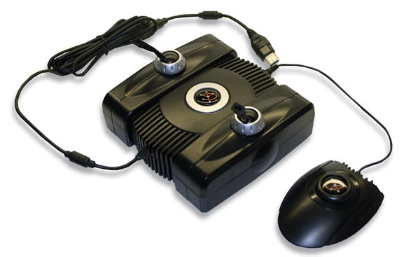
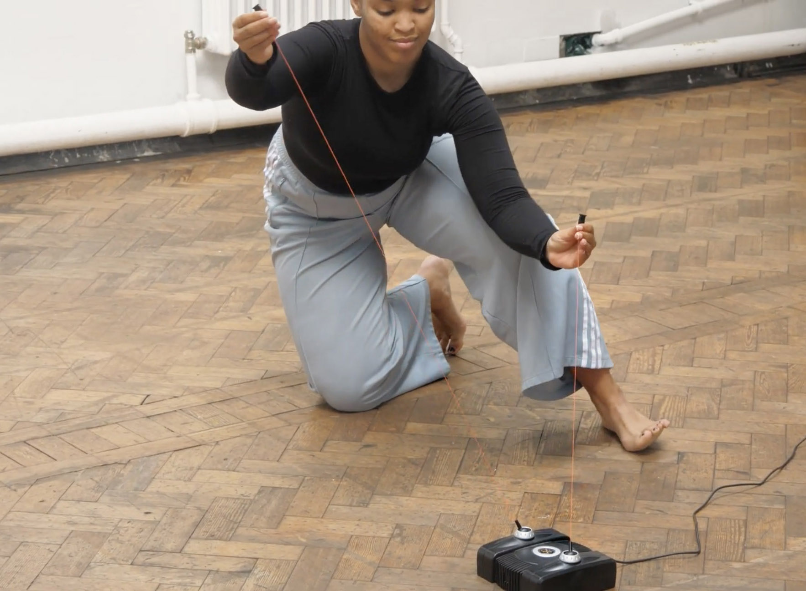
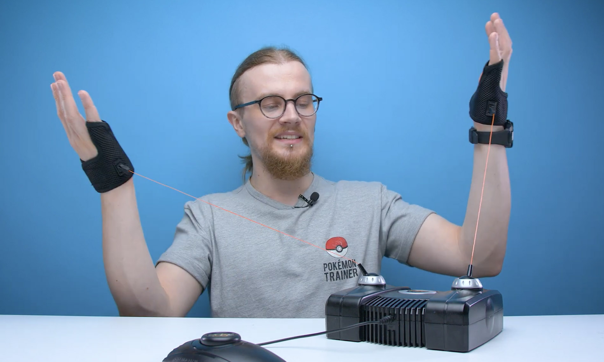
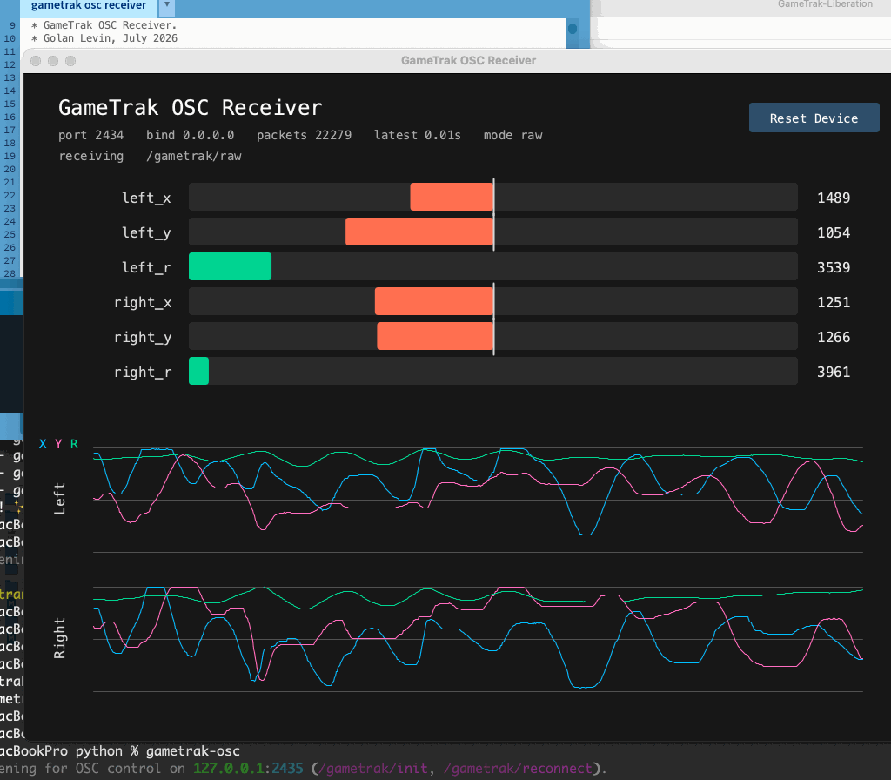
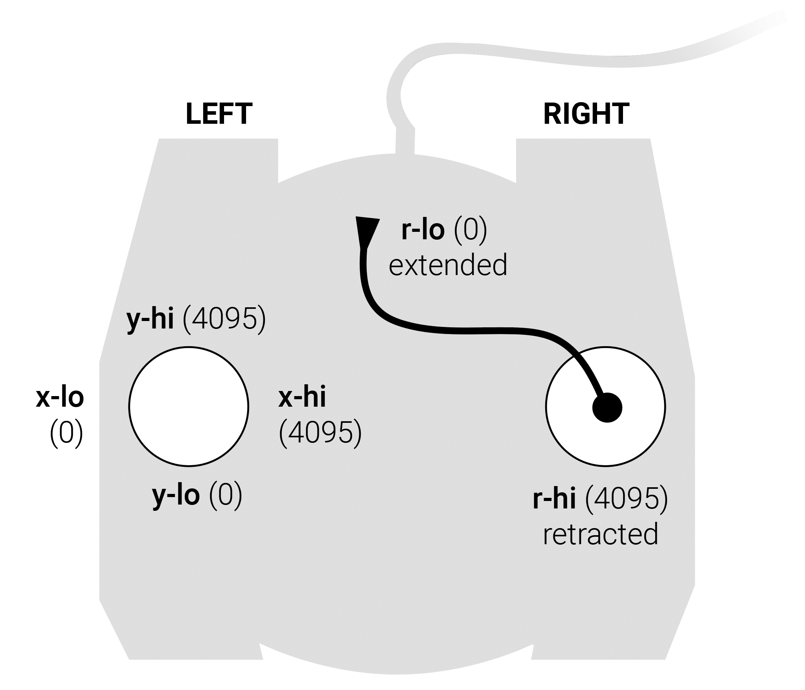

# GameTrak Liberation

By Golan Levin, July 2026


---

## Overview

This project makes the In2Games [GameTrak](https://en.wikipedia.org/wiki/Gametrak)  PlayStation controller usable as a six-axis [HID](https://en.wikipedia.org/wiki/Human_interface_device) (human interface device) via [OSC](https://en.wikipedia.org/wiki/Open_Sound_Control), [MIDI](https://en.wikipedia.org/wiki/MIDI), [WebMIDI](https://www.w3.org/TR/webmidi/), [WebSockets](https://en.wikipedia.org/wiki/WebSocket), and other workflows. Working examples are provided for popular creative coding environments including [Processing](https://processing.org/) (Java), [p5.js](https://p5js.org/), and Python.

This work builds on the [libgametrak](https://github.com/casiez/libgametrak) C-language library by Géry Casiez ([@casiez](https://github.com/casiez/)) — especially his discovery of the GameTrak's special USB initialization message. The GameTrak controller appears on macOS as a standard USB HID joystick-class device. *However*, the GameTrak does not begin to stream useful data until it receives the initialization message used by `libgametrak`'s PS2 mode. More information about credits, references, and redistributed third-party code can be found [here](THIRD_PARTY.md).

This work has been tested in macOS 15.6 using Python 3.10 and 3.14, Processing 4.5.5 and 4.3, and p5.js 1.11.13 and 2.3.0. The specific unit tested here is physically labeled *GameTrak V2.0* on its underside, while USB reports *Game-Trak V1.3* from *In2Games Ltd*; it uses VID `0x14B7` and PID `0x0982`. 

**Contents:**

* [About the GameTrak Controller](#about-the-gametrak-controller)
* [Supported Workflows](#supported-workflows)
* [Quick Start](#quick-start)
* [Python Commands](#python-commands)
* [Processing And p5.js](#processing-and-p5js)
* [Device And Protocol Facts](#device-and-protocol-facts)
* [Calibration Boundary](#calibration-boundary)
* [Development](#development)
* [Troubleshooting](#troubleshooting)

---

## About the GameTrak Controller



The GameTrak was originally made as a PlayStation 2 controller for the golf
game *Real World Golf* by In2Games Ltd. Its unusual interface has two joystick assemblies, each with X/Y motion plus a retractable tether, yielding six 12-bit position streams in the `0..4095` range at 75 Hz. Because used units can be quite [inexpensive on eBay](https://www.ebay.com/sch/i.html?_nkw=Gametrak+controller+PS2) (about
USD 20-40), and because the tethered joysticks are expressive and physically
legible 3D position-trackers, the device has become a popular platform for experimental interfaces, especially in electronic music and machine-learning workflows such as
[Wekinator](https://doc.gold.ac.uk/~mas01rf/Wekinator/). Some examples of creative projects that use the GameTrak can be found listed [here](docs/prior_art.md). 


---

## Supported Workflows

[](https://www.youtube.com/watch?v=HdFHGbpswag&t=189s)<br />*From "[Capturing Movement in Sound](https://www.youtube.com/watch?v=HdFHGbpswag&t=189s)" (2024) by Richard McReynolds, performed by Jodi Ann Nicholson. [More information](https://richardmcreynolds.com/blog/2024/1/8/yx7md3hbz8mngcy14oat54rgljgknf).*


This repository presents several ways to acquire, translate, and use data from the GameTrak controller:

| Path | What It Is, When To Use It|
|---|---|
| `gametrak-stdout` | **HID-to-stdout**. This is a command-line program, built in Python, which emits GameTrak controller data to `stdout` in the Terminal. It is good for quick diagnostics, logging, piping data to other programs, and other Unix-style scripts. |
| `gametrak-record` | **HID-to-JSONL**. This is a command-line program, built in Python, which records full raw HID reports as [JSONL](https://scrapfly.io/blog/posts/jsonl-vs-json) files. It is intended for protocol research, official sample captures, bug reports, and reproducible test data. |
| `gametrak-playback` | **JSONL-to-stdout/OSC/MIDI/WebSocket**. This is an offline command-line program, built in Python, which replays `gametrak-record` captures through one selected output protocol. It is useful for receiver development without the physical controller. |
| `gametrak-osc` | **HID-to-OSC**. This is a command-line program, built in Python,  which transmits GameTrak controller data over OSC to other software (such as Processing, TouchDesigner, Max/MSP, etc.). A Processing (Java) OSC receiver is also provided. |
| `gametrak-midi` | **HID-to-MIDI**. This is a command-line program, built in Python, which transmits GameTrak controller data as MIDI pitch-bend signals. It is usable with any MIDI software (Max/MSP, Ableton Live, Logic, VCV Rack, MIDI Monitor) that can read virtual MIDI ports, as well as web applications in browsers that support WebMIDI. A p5.js receiver is also provided. |
| `gametrak-ws` | **HID-to-WebSocket JSON**. This is a command-line program, built in Python, which streams GameTrak data to browser sketches over native WebSockets. It is useful for p5.js and other JavaScript projects and does not require Node.js or WebMIDI. A p5.js receiver is also provided. |
| [gametrak_midi_receiver_p5v2](p5js/gametrak_midi_receiver_p5v2/README.md) | **MIDI-to-p5**. This is a p5.js (v.2.3.0) sketch which receives and visualizes MIDI data from `gametrak-midi` via WebMIDI. The six 12-bit data streams are sent as pitch-bend signals on MIDI channels 1-6. Both v1 and v2 of p5.js are supported. Uses [webmidi.js](https://webmidijs.org/). |
| [gametrak_ws_receiver_p5v2](p5js/gametrak_ws_receiver_p5v2/README.md) | **WebSocket-to-p5**. This is a p5.js (v.2.3.0) sketch which receives and visualizes JSON messages from `gametrak-ws` over browser-native WebSockets. Both v1 and v2 of p5.js are supported. |
| [gametrak_osc_receiver](processing/gametrak_osc_receiver/) | **OSC-to-Processing**. This is a Processing (v.4.5.5) app which receives and visualizes OSC data from `gametrak-osc`. By default, OSC receivers should listen on UDP port 2434. |
| [gametrak_standalone](processing/gametrak_standalone/) | **HID-to-Processing**. This is a standalone Processing (v.4.5.5) sketch that connects to the GameTrak directly as an HID device. No other software is required. Uses [hid4java](https://github.com/gary-rowe/hid4java). |
| [gametrak_osc_transmitter](processing/gametrak_osc_transmitter/) | **HID-to-OSC**. This is a standalone Processing (v.4.5.5) sketch that connects to the GameTrak directly as an HID device and transmits `/gametrak/raw` OSC. No other software is required, but it can be used with the [gametrak_osc_receiver](processing/gametrak_osc_receiver/).  |

All paths expose the same semantic channel order:

```text
left_x left_y left_r right_x right_y right_r
```

* Raw values are `0..4095`. 
* Joystick X/Y values are centered controls. 
* Tether `R` values are inverted relative to its “extension” (a short/retracted tether reads high, while pulling it out makes the raw value go down). 
* The GameTrak footswitch was not available for testing and is not yet supported. 


---

## Quick Start



**Install** the Python commands from a source checkout with `pipx`:

```bash
cd python
pipx install --python python3.10 .
```

If you already installed an earlier checkout, force a reinstall so new commands
and dependencies are picked up:

```bash
cd python
pipx install --force --python python3.10 .
```

If `pipx install .` reports that Python 3.9 is too old, keep using the explicit
`--python python3.10` form above, or point `pipx` at another installed Python
3.10+ interpreter.

Run one of the Python "bridge" apps:

* `gametrak-stdout` — prints data to the Terminal
* `gametrak-record` — records a JSONL file
* `gametrak-playback` — replays a JSONL file without the device
* `gametrak-osc` — transmits OSC
* `gametrak-midi` — transmits MIDI
* `gametrak-ws` — transmits WebSocket JSON for browser sketches

Do not run multiple HID-owning bridges at the same time. For example, you
should quit `gametrak-osc` before launching `gametrak-midi`, `gametrak-ws`,
`gametrak-record`, or the standalone Processing HID sketch. `gametrak-playback`
does not open the GameTrak device, so it can be used when the controller is not
attached.

*(Image from Charles Lootd's GameTrak [review](https://www.youtube.com/watch?v=0VzQ3KgV5Gc) video)*

---

## Python Commands

Hardware-owning Python commands support:

```bash
--diagnose
```

Diagnostic mode prints a technical HID/USB report and exits without streaming.
It includes expected VID/PID, matching hidapi devices, manufacturer/product
strings, usage page/usage, interface number, hidapi path, a short open/close
probe, and macOS USB topology when `system_profiler` exposes it.


### `gametrak-stdout`

`gametrak-stdout` prints exactly six values per line:

```text
left_x left_y left_r right_x right_y right_r
```

Examples:

```bash
gametrak-stdout
gametrak-stdout --rate 30
gametrak-stdout --normalized --precision 4
gametrak-stdout --hex
gametrak-stdout --0dec
gametrak-stdout --diagnose
```

Modes:

| Option | Output | Example value |
|---|---|---|
| default / `--raw` | raw decimal `0..4095` | `26` |
| `--0dec` | raw decimal, 4-digit zero-padded | `0026` |
| `--hex` | raw hex, 3-digit uppercase zero-padded | `01A` |
| `--normalized` | descriptor-scale convenience floats | `-0.125` |

Because stdout contains only data lines and diagnostics go to stderr, normal
Unix pipelines work:

```bash
gametrak-stdout --rate 30 > capture.txt
gametrak-stdout --rate 30 | awk '{ print $1, $2 }'
gametrak-stdout --rate 30 | ./my-gametrak-consumer
```

### `gametrak-record`

`gametrak-record` writes a JSONL capture of full HID input reports. Each line is
one JSON object. The first line is session metadata, each report line preserves
the original report bytes plus decoded axes, and the final line is a summary.

```bash
gametrak-record --seconds 10 --out sample_reports/official_001.jsonl
gametrak-record --seconds 10 --label official --note "short movement sample" --out sample_reports/official_001.jsonl
gametrak-record --seconds 5 --print
gametrak-record --diagnose
```

JSONL is used instead of one large JSON file because GameTrak data is a stream:
partial captures remain useful if recording is interrupted, files can be
inspected with `tail` while recording, and the format stays friendly to Unix
pipelines.


### `gametrak-playback`

`gametrak-playback` replays a JSONL capture made by `gametrak-record`. It does not open the GameTrak device. Instead, it reconstructs decoded reports from the
stored `raw_bytes_hex` rows and emits them through one selected protocol. Some sample recordings are [here](sample_reports/README.md).

```bash
gametrak-playback sample_reports/gametrack_sample_10_second_recording.jsonl --stdout
gametrak-playback sample_reports/gametrack_sample_10_second_recording.jsonl --stdout --rate 30
gametrak-playback sample_reports/gametrack_sample_10_second_recording.jsonl --osc --loop
gametrak-playback sample_reports/gametrack_sample_10_second_recording.jsonl --ws --loop
gametrak-playback sample_reports/gametrack_sample_10_second_recording.jsonl --midi --port-name "GameTrak Playback"
```

Choose exactly one output protocol:

| Option | Output |
|---|---|
| `--stdout` | Terminal lines matching `gametrak-stdout` |
| `--osc` | OSC messages matching `gametrak-osc` |
| `--midi` | MIDI pitch bend matching `gametrak-midi` |
| `--ws` | WebSocket JSON matching `gametrak-ws` |

By default, playback follows the recorded `elapsed_ns` timing. Use `--rate` to
force a fixed output rate, `--speed` to scale recorded timing, and `--loop` to
repeat the capture indefinitely while developing receivers.

Output mode flags match the live tools where they apply:

```bash
gametrak-playback sample_reports/gametrack_sample_10_second_recording.jsonl --stdout --hex
gametrak-playback sample_reports/gametrack_sample_10_second_recording.jsonl --stdout --normalized
gametrak-playback sample_reports/gametrack_sample_10_second_recording.jsonl --osc --normalized
gametrak-playback sample_reports/gametrack_sample_10_second_recording.jsonl --ws --normalized
gametrak-playback sample_reports/gametrack_sample_10_second_recording.jsonl --osc --wekinator
```

`--hex` and `--0dec` are stdout-only. MIDI playback uses raw GameTrak values,
just like `gametrak-midi`.


### `gametrak-osc`

`gametrak-osc` reads the GameTrak over HID, sends the required init/keepalive
sequence, decodes reports, and broadcasts OSC. You can test it with the provided Processing program, [gametrak_osc_receiver](processing/gametrak_osc_receiver/).

```bash
gametrak-osc
gametrak-osc --host 127.0.0.1 --port 2434
gametrak-osc --raw --normalized --rate 60 --print
gametrak-osc --diagnose
gametrak-osc --wekinator
```

Default output is raw (i.e., 12-bit values in the range `0...4095`):

```text
/gametrak/raw
  int left_x left_y left_r right_x right_y right_r buttons
```

Optional normalized output (joystick X/Y values in `-1..1`; tether extension values in `0..1`):

```text
/gametrak/normalized
  float left_x left_y left_r right_x right_y right_r
```

For normalized values, joystick X/Y axes are descriptor-scale `-1..1`; tether
R axes are descriptor-scale `0..1`, where `0` means retracted/short and `1`
means extended. These values are convenience values, not per-device calibrated
values.

"[Wekinator](https://doc.gold.ac.uk/~mas01rf/Wekinator/)" mode sends:

```text
/wekinator/control/inputs
  float left_x left_y left_r right_x right_y right_r
```

The OSC bridge also listens for control messages by default:

```text
127.0.0.1:2435

/gametrak/init
  Resend the init sequence on the current HID handle.

/gametrak/reconnect
  Close/reopen the HID handle, then resend init.
```

Use `--rate` only to throttle output below the device's natural report rate.
Omitting `--rate` sends every valid HID report.


### `gametrak-midi`

`gametrak-midi` creates a virtual MIDI output named `GameTrak MIDI`.
Chrome sees that virtual output as a WebMIDI input. You can test this with the provided p5 WebMIDI sketch, [gametrak_midi_receiver_p5v2](p5js/gametrak_midi_receiver_p5v2/README.md).

```bash
gametrak-midi
gametrak-midi --rate 60
gametrak-midi --print
gametrak-midi --port-name "GameTrak MIDI"
gametrak-midi --diagnose
```

The bridge sends raw GameTrak values directly as signed MIDI pitch bend values
`0..4095` on channels 1-6:

| MIDI channel | GameTrak value |
|---:|---|
| 1 | `left_x` |
| 2 | `left_y` |
| 3 | `left_r` |
| 4 | `right_x` |
| 5 | `right_y` |
| 6 | `right_r` |

WebMIDI exposes pitch bend's unsigned wire value as `event.rawValue`, so a
browser receiver subtracts `8192` to recover the signed value:

```js
const rawGameTrakValue = event.rawValue - 8192;
```


### `gametrak-ws`

`gametrak-ws` opens the GameTrak over HID and serves browser-native WebSocket
JSON on `ws://127.0.0.1:2436`. It is intended for p5.js and other browser
apps that cannot receive UDP OSC and do not need WebMIDI.

```bash
gametrak-ws
gametrak-ws --host 127.0.0.1 --port 2436
gametrak-ws --normalized
gametrak-ws --rate 60
gametrak-ws --print
gametrak-ws --diagnose
```

Each WebSocket text message is compact JSON:

```json
{"address":"/gametrak/raw","args":[123,2048,4095,500,900,3900,0]}
```

The first six `args` values are:

```text
left_x left_y left_r right_x right_y right_r
```

The seventh value is the decoded button bitfield.

With `--normalized`, `gametrak-ws` sends `/gametrak/normalized` with six
descriptor-scale normalized floats and no button bitfield:

```json
{"address":"/gametrak/normalized","args":[0.0,0.0,0.0,1.0,-1.0,1.0]}
```


---

## Processing And p5.js




### Processing Standalone HID

Path:

```text
processing/gametrak_standalone/
```

[**This Processing sketch**](processing/gametrak_standalone/gametrak_standalone.pde) talks to the GameTrak directly through `hid4java`. It does not
require Python, OSC, WebMIDI, or a local server. It has been tested in
Processing 4.3 and Processing 4.5.5 on macOS 15.6.

Bundled Java dependencies:

```text
processing/gametrak_standalone/code/hid4java-0.8.0.jar
processing/gametrak_standalone/code/jna-5.14.0.jar
```

Source layout:

```text
processing/gametrak_standalone/gametrak_standalone.pde
processing/gametrak_standalone/GameTrakDirectHid.java
```

The `.pde` file owns the Processing UI. The `.java` helper owns all direct HID
work so Processing's PDE preprocessor does not have to parse external
`hid4java` types.

Quit any GameTrak Python bridge before running this sketch so both programs do not
compete for the same HID handle.


### Processing OSC Transmitter

Path:

```text
processing/gametrak_osc_transmitter/
```

[**This Processing sketch**](processing/gametrak_osc_transmitter/gametrak_osc_transmitter.pde) talks to the GameTrak directly through `hid4java` and sends each
valid HID report as OSC `/gametrak/raw` to `127.0.0.1:2434`. It does not
require `gametrak-osc` or any other Python tool. It also listens for OSC
control messages on `127.0.0.1:2435`.

OSC payload:

```text
/gametrak/raw
  int left_x left_y left_r right_x right_y right_r buttons
```

Quit any other GameTrak HID client before running this sketch. It owns the HID
handle directly.

Control messages:

```text
/gametrak/init
/gametrak/reconnect
```


### Processing OSC Receiver

Path:

```text
processing/gametrak_osc_receiver/
```

[**This Processing sketch**](processing/gametrak_osc_receiver/gametrak_osc_receiver.pde) receives `/gametrak/raw` OSC data on UDP port `2434`
using a small dependency-free OSC parser built on `java.net.DatagramSocket`.
It visualizes the six raw values as bars and shows left/right X/Y timelines.

It can work with either `gametrak-osc` or the Processing-based [gametrak_osc_transmitter](processing/gametrak_osc_transmitter/). For example, run:

```bash
gametrak-osc
```

Then open the Processing sketch.

The sketch includes a reset button that sends `/gametrak/reconnect` to the
Python OSC bridge's control port, UDP `2435`. The data port `2434` was chosen
because it is the GameTrak's HID Product ID; the control port uses the next
port number.


### p5.js MIDI Receiver

[**This p5.js sketch**](p5js/gametrak_midi_receiver_p5v2/README.md) uses WebMIDI to receive MIDI signals from the `gametrak-midi` Python bridge.

Path:

```text
p5js/gametrak_midi_receiver_p5v2/
```

Run the MIDI bridge:

```bash
gametrak-midi
```

Serve the repo over localhost, i.e. [on a local server](https://dev.to/kardelio/3-different-ways-to-start-a-http-web-server-from-the-terminal-4am3):

```bash
cd path/to/GameTrak-Liberation
python3 -m http.server 8000
```

Open in Chrome:

```text
http://127.0.0.1:8000/p5js/gametrak_midi_receiver_p5v2/
```

Click `Enable MIDI` and allow Chrome's MIDI permission prompt. The sketch
prefers the input named `GameTrak MIDI`. Versions of the p5 sketch are available for both v1 and v2 of p5.js:

* [gametrak_midi_receiver_p5v1](p5js/gametrak_midi_receiver_p5v1/README.md) (v.1.11.13)
* [gametrak_midi_receiver_p5v2](p5js/gametrak_midi_receiver_p5v2/README.md) (v.2.3.0)

### p5.js WebSocket Receiver

[**This p5.js sketch**](p5js/gametrak_ws_receiver_p5v2/README.md) receives JSON messages from `gametrak-ws` using the browser's native WebSocket API.

Path:

```text
p5js/gametrak_ws_receiver_p5v2/
```

Run the WebSocket bridge:

```bash
gametrak-ws
```

Open the sketch directly in Chrome:

```text
file:///path/to/GameTrak-Liberation/p5js/gametrak_ws_receiver_p5v2/index.html
```

The sketch connects to `gametrak-ws` at:

```text
ws://127.0.0.1:2436
```

No local HTTP server is required for this WebSocket receiver. If you prefer to
serve the static files with `python3 -m http.server`, that is also fine, but (e.g.)
port `8000` is only the page server; GameTrak data still arrives over WebSocket
port `2436`.

Versions of the WebSocket sketch are available for both v1 and v2 of p5.js:

* [gametrak_ws_receiver_p5v1](p5js/gametrak_ws_receiver_p5v1/README.md) (v.1.11.13)
* [gametrak_ws_receiver_p5v2](p5js/gametrak_ws_receiver_p5v2/README.md) (v.2.3.0)

---

## Device And Protocol Facts

* Additional information about the GameTrak communication protocol can be found [here](docs/protocol.md).
* Sample recordings of the GameTrak's data can be found [here](sample_reports/README.md).

Verified USB identity:

| Property | Value |
|---|---|
| Physical underside label | `GameTrak V2.0` golfing interface device for PlayStation |
| USB product string | `Game-Trak V1.3` |
| USB manufacturer string | `In2Games Ltd.` |
| Vendor ID | `0x14B7` decimal `5303` |
| Product ID | `0x0982` decimal `2434` |
| USB speed | Full-speed USB, 12 Mbps |
| HID usage page | `0x01`, Generic Desktop |
| HID primary usage | `0x04`, Joystick |
| Max input report size | 16 bytes |
| Max output report size | 4 bytes |

The HID descriptor exposes six absolute axes:

```text
X, Y, Z, Rx, Ry, Rz
```

Each axis is a 16-bit little-endian field with logical range `0..4095`.

Empirical semantic mapping:

| HID field | Semantic value | Direction note |
|---|---|---|
| `X` | `left_x` | low = left, high = right |
| `Y` | `left_y` | low = toward user, high = away |
| `Z` | `left_r` | high = retracted/short, lower = extended |
| `Rx` | `right_x` | low = left, high = right |
| `Ry` | `right_y` | low = toward user, high = away |
| `Rz` | `right_r` | high = retracted/short, lower = extended |




Known report notes:

```text
bytes 0-11: six uint16_le axes
byte 12 bits 0-3: hat switch per descriptor
byte 12 bits 4-7 plus byte 13: 12 buttons per descriptor
bytes 14-15: descriptor padding, but live captures show right-tether-related movement
```

The available hardware used for testing did not include the external footswitch. The descriptor exposes button bits, but footswitch bit index and polarity remain untested.

Full protocol notes live in:

```text
docs/protocol.md
```

---

## Calibration Boundary

The Python tools and Processing sketches do not perform per-device calibration.
They are responsible for:

```text
- opening the HID device
- sending init/keepalive writes
- decoding reports
- applying the fixed semantic channel order
- emitting or displaying raw values
```

Application code should handle:

```text
- per-device min/max calibration
- deadband
- smoothing/filtering
- coordinate transforms
- gesture interpretation
- application-specific scaling
```

Descriptor-scale normalized values exist only as convenience output when
explicitly requested.


---

## Development

For Python development:

```bash
cd python
python -m pip install -e ".[dev]"
python -m pytest
```

Repository layout:

```text
python/       Python package, CLIs, tools, tests
processing/   Processing OSC and standalone HID sketches
p5js/         Browser MIDI sketches
docs/         Protocol and prior-art documentation
sample_reports/ Captured sample reports
```

Useful source docs:

```text
docs/protocol.md
docs/prior_art.md
THIRD_PARTY.md
sample_reports/README.md
```


---

## Troubleshooting

If no reports arrive, make sure the device is connected directly or through a
reliable powered path. On macOS, moving from a hub to a direct adapter caused
the OS to ask for USB accessory permission for the tested unit.

If a bridge cannot open the HID device, quit other HID clients first. Chrome
WebMIDI, the standalone Processing HID sketch, and Python bridges can compete
for the same device.

If `pipx install .` uses Python 3.9, reinstall with:

```bash
pipx install --force --python python3.10 .
```

If Chrome does not show the WebMIDI input, keep `gametrak-midi` running and
reload the p5 page from `http://127.0.0.1`, not `file://`.

Use diagnostics for a quick device report:

```bash
gametrak-osc --diagnose
gametrak-stdout --diagnose
gametrak-record --diagnose
gametrak-midi --diagnose
```

---
