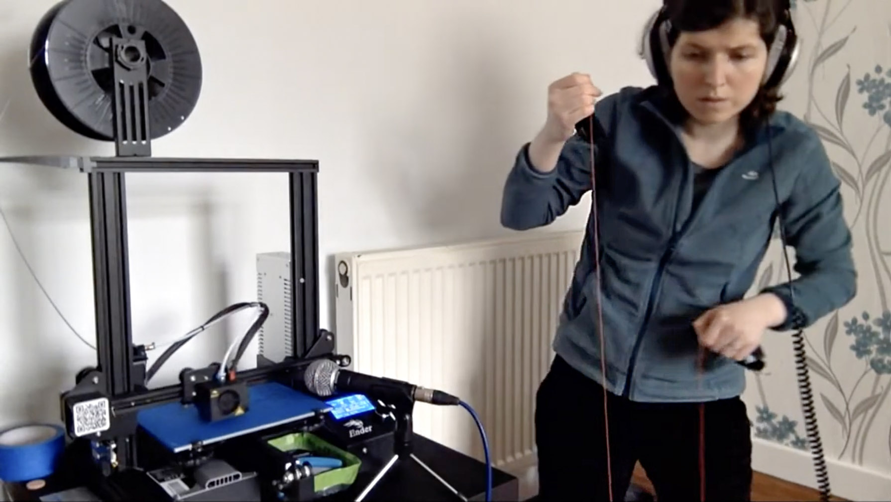
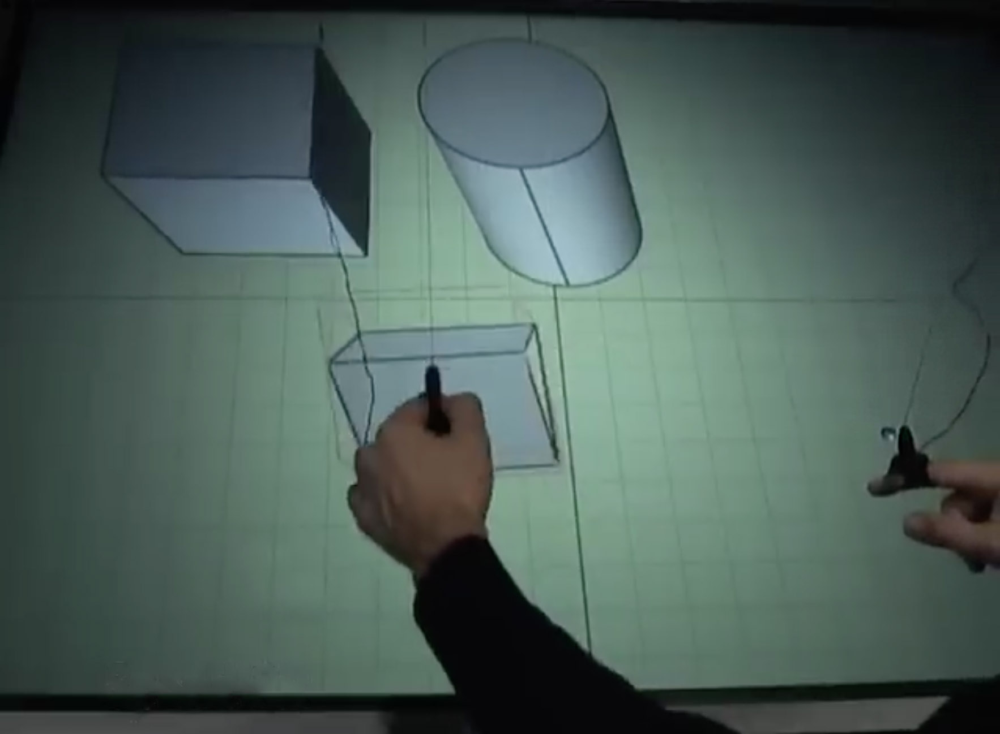

# GameTrak Prior Art

[](https://www.youtube.com/watch?v=K9OYlnF-eto)

**Contents**

* [The foundation: `libgametrak`](#the-foundation-libgametrak)
* [Other Related Work and GameTrak Hacking](#other-related-work-and-gametrak-hacking)

---

## Technical foundation: `libgametrak`

Source: <https://github.com/casiez/libgametrak>

**[`libgametrak`](https://github.com/casiez/libgametrak)** by Géry Casiez is the most relevant prior implementation of an interface to the GameTrak that we found. It is a C++ cross-platform library based on HIDAPI.

Observed implementation details from `libgametrak/HIDAPIGameTrak.cpp`:

- Opens VID `0x14B7`, PID `0x0982`.
- Default path uses `hid_open(0x14B7, 0x0982, NULL)`.
- Default event loop uses blocking `hid_read(handle, buf, 16)`.
- Default mode does not appear to send an initialization output report.
- Optional `ps2mode` does send output reports:
  - initially writes the bytes for `Gametrak`
  - then periodically writes two-byte reports beginning with `0x45` or `0x46`
- Optional PicTrak support exists for Jan Ciger's PicTrak modification.

Important discrepancy:

```text
Our HID descriptor says bytes 14-15 are padding after:
- six 16-bit axes at bytes 0-11
- 4-bit hat and 12 button bits at bytes 12-13

libgametrak normal mode decodes one axis from bytes 14-15:
rawLeftTheta = (buf[15] << 8) + buf[14]
```

This could mean one of several things:

- The library targeted a different GameTrak firmware/revision.
- macOS's descriptor interpretation for this unit differs from the practical
  report bytes used by that library.
- The prior implementation intentionally used bytes that the descriptor marks as
  padding because those bytes carried useful data on its hardware.

Do not discard bytes 14-15 in live captures. Preserve the full raw 16-byte
report and compare both descriptor-derived and libgametrak-style mappings.

Local test result:

```text
Result:
Device opened, but blocking read did not return a report within the test window.
```

Empirical result after trying the optional ps2mode sequence:

```text
Result:
Device opened and started streaming 16-byte reports after:
1. writing "Gametrak"
2. writing 45 23
3. periodically writing 46 <key>
```

First 15-second capture:

```text
Rows: 1137
Valid sensor reports after init echo: 1136
Mean rate: approximately 76 Hz
Axis mins: [4017, 618, 3561, 2897, 324, 3614]
Axis maxs: [4051, 1250, 3710, 4077, 853, 3706]
```

---

## Other Related Work and GameTrak Hacking

* [Jenn Kirby, *Duet for 3D Printer and Gametrak*](https://www.youtube.com/watch?v=K9OYlnF-eto). A live electronic music performance in which a 3D printer is controlled by a GameTrak interface.
* [Chris O'Shea, *Drop Spin Fade*](https://www.chrisoshea.org/portfolio/drop-spin-fade) - interactive artwork reference involving GameTrak-style gestural control.
* [Richard McReynolds, *The GameTrak Controller*](https://richardmcreynolds.com/blog/2024/1/8/yx7md3hbz8mngcy14oat54rgljgknf) - new-media dance and sound context, including *Capturing Movement in Sound*.
* [David Goldberg, *Game Trak*](https://www.davidgoldberg.net/gesticularcontroller) - musical-interface notes connecting GameTrak, Wekinator, Max/MSP, SuperCollider, and spatial control.
* [ResearchGate figure: GameTrak tether controller and hemispherical speaker](https://www.researchgate.net/figure/a-GameTrak-Tether-Controller-and-bHemispherical-Speaker-with-Subwoofer_fig2_353363867) - figure from *Instrument Design for The Furies: A LaptOpera*.
* [Gareth W. Young, *GameTrak game controller Project*](https://gareth.prof/2014/10/23/gametrak-game-controller-project/) - Arduino/Processing/OSC hardware rebuild, including a haptic bowl modification.
* [Jan Ciger, *Modding GameTrak game controller for PC use*](http://janoc.rd-h.com/archives/129) - teardown notes, revision differences, and PC-mod guidance for PlayStation 2 units.
* [X37V, *Mad Catz Gametrak Mod for Max/MSP*](http://x37v.com/x37v/writing/mad-catz-gametrak-mod-for-maxmsp/) - solder-bridge modification exposing six 12-bit axes to Max/MSP through HID.
* [YouTube video reference: GameTrak-related demo/performance](https://www.youtube.com/watch?v=Y4iimo20wSQ)
* [YouTube video reference: GameTrak-related demo/performance](https://www.youtube.com/watch?v=QPqQ0vU0yjw)

[](https://www.youtube.com/watch?v=ZxJD9DXDB1E)<br />*Bruno De Araujo, "[Mockup Builder: Direct 3D Modeling On and Above the Surface in a Continuous Interaction Space](https://www.youtube.com/watch?v=ZxJD9DXDB1E)", 2012.*
